# Fractor

_Sleek fractal viewer & generator that I wrote 2015 when I was bored in high school_

Afterwards I realized I was doing several things rather overcomplicatedly, but in hindsight isn't this always what you notice? 

Runs with Java and Javafx somewhere before the big changes made after Javafx 8, using good ol' Eclipse (2015 that was probably still fine)

Since it will take time to actually get it running again, here some screenshots I made: 

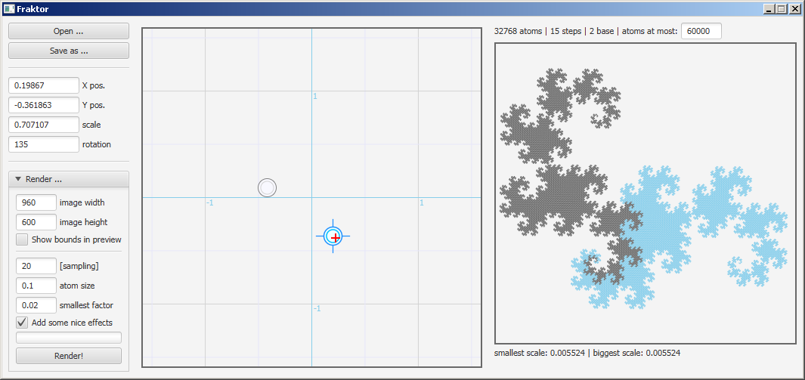
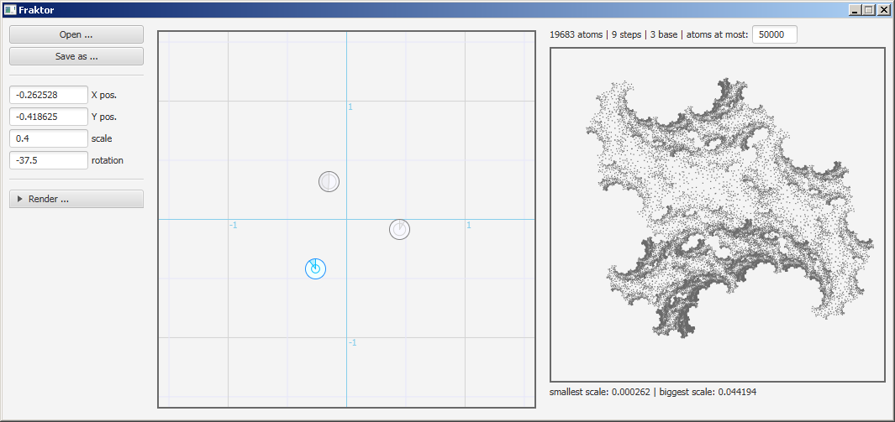
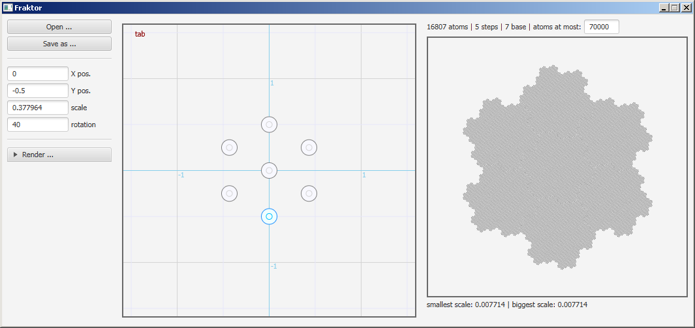
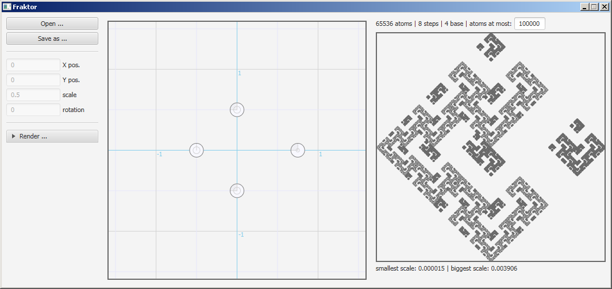
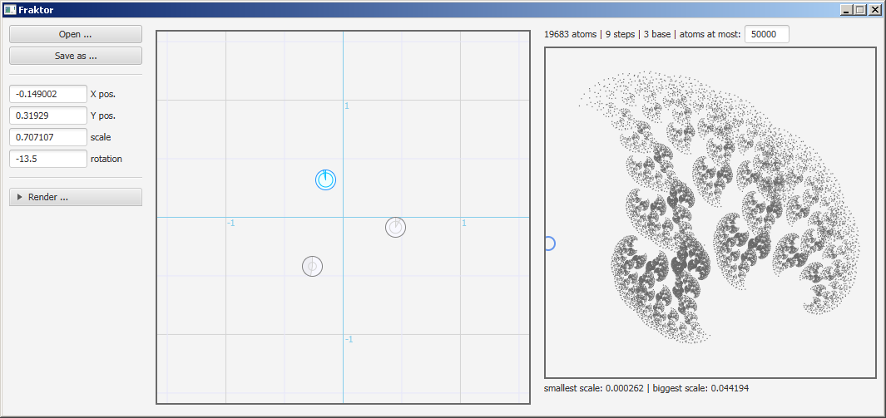
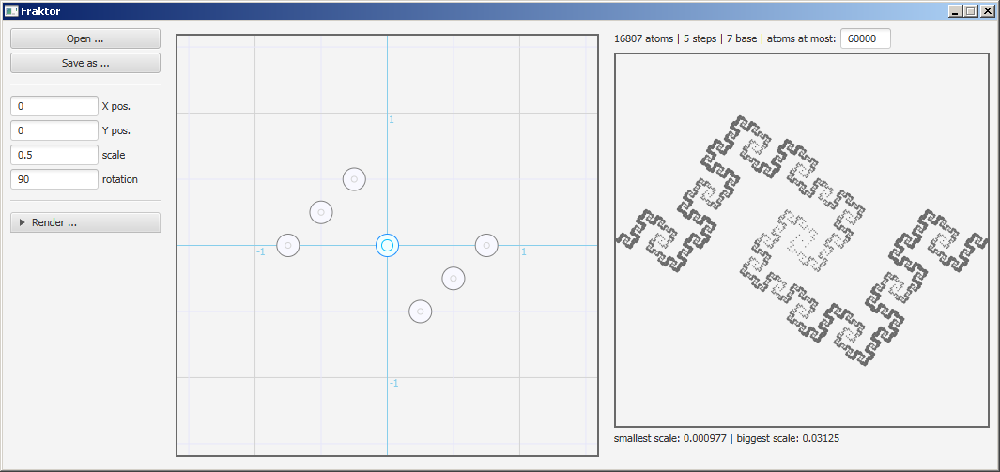
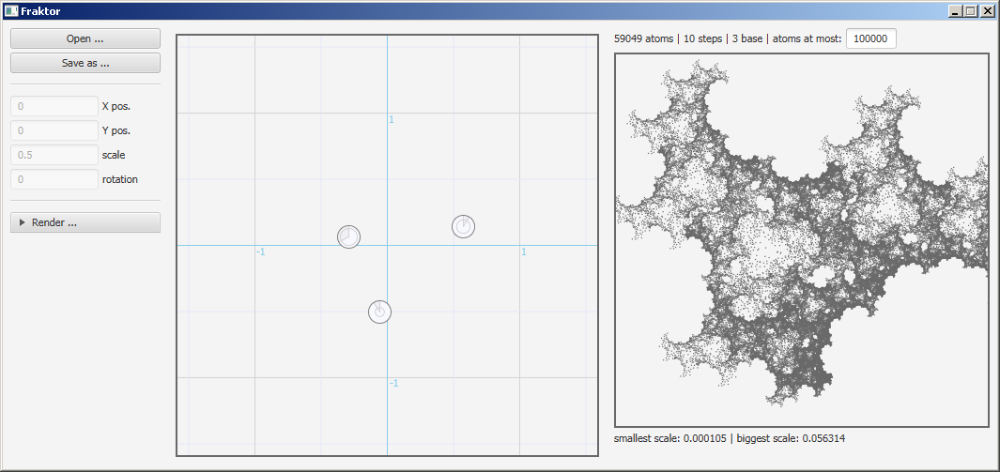
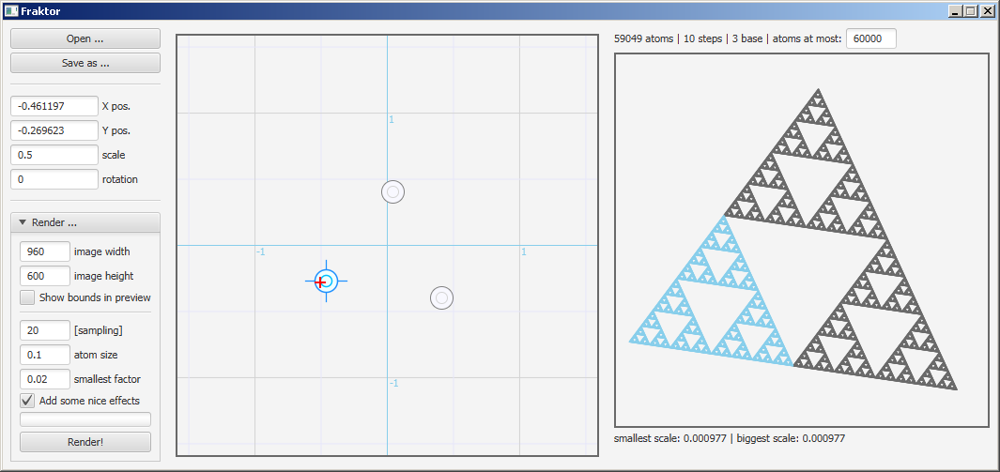
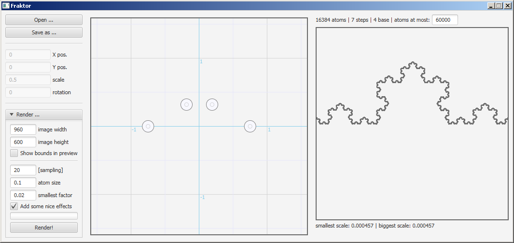
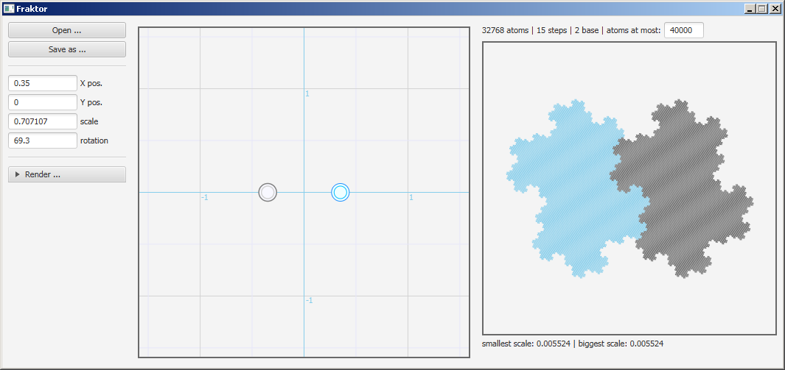
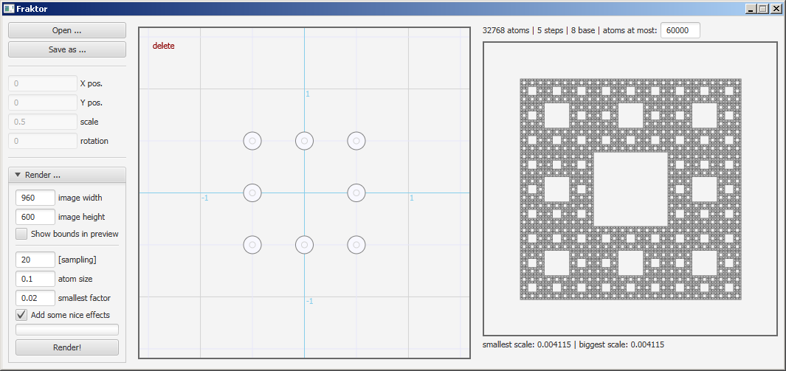